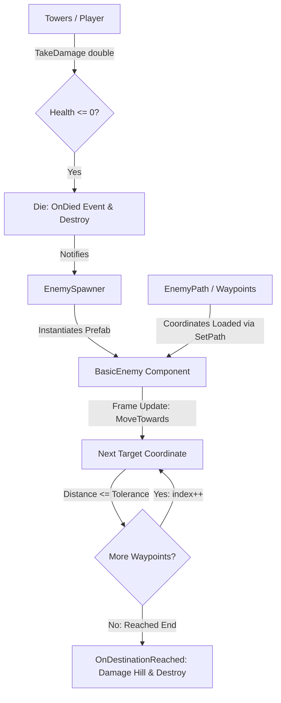

# Technical Documentation: BasicEnemy.cs (Enemy Scripts)

**Target Unity Version**: Unity 6 (`6000.6.0f1`)  
**Context**: 2D Hybrid Tower Defense Game  
**File Location**: `Hold the Hill/Assets/_Game/Features/Enemies/Scripts/BasicEnemy.cs`  
**Companion Files**: 
- `Hold the Hill/Assets/_Game/Features/Enemies/Scripts/EnemyPath.cs`
- `Hold the Hill/Assets/Scripts/EnemySpawner/EnemySpawner.cs`
- `Hold the Hill/Assets/_Game/Tests/EditMode/BasicEnemyTests.cs`

---

## 1. Overview & Architecture

`BasicEnemy` is the baseline component providing core statistics, damage handling, and path traversal functionality for all basic enemies in *Hold the Hill*.

It is designed to serve two roles simultaneously:
1. **Ready-to-Use Component**: Can be attached directly to standard enemy prefabs (e.g., standard creep, swarmers, brutes) with balance stats tuned via the Unity Inspector.
2. **Extensible Superclass**: Features virtual lifecycle and action methods (`TakeDamage`, `Die`, `TraversePath`, `UpdateFacing`) that specialized enemy types (e.g., armored enemies, splitting enemies, flying units) can inherit from and override.



### Key Architectural Pillars
- **Strictly Typed Stats**: Health is maintained with `double` precision (`_maxHealth`, `_currentHealth`) for fractional combat calculations, while combat/base attack power is declared as an `int` (`_damage`).
- **Autonomous Path Traversal**: Smoothly moves along an ordered list of 2D coordinates using `Vector3.MoveTowards` with frame-rate independent `Time.deltaTime` calculations and 2D Z-plane locking.
- **Visual Direction Adaptation**: Dynamically inspects movement velocity along the X-axis and mirrors the attached `SpriteRenderer` (`flipX`) so enemies face their walking direction.
- **Decoupled Observer Events**: Broadcasts `OnHealthChanged`, `OnDied`, and `OnDestinationReached` C# events to allow UI health bars, audio controllers, minimaps, and spawners to react without tight coupling.
- **Editor Scene Visualization**: Implements `OnDrawGizmosSelected` to render the assigned path (red route) and current waypoint target (green line) in the Scene view for effortless level design and debugging.

---

## 2. Inspector Fields Reference

### Health & Combat
| Field | Type | Default | Description |
| :--- | :--- | :--- | :--- |
| `_maxHealth` | `double` | `100.0` | Maximum health pool of the enemy. Initialized to `_currentHealth` in `Awake()`. |
| `_damage` | `int` | `1` | Attack power of this enemy (e.g. damage dealt to the hill or player base upon reaching the final waypoint). |

### Path & Movement
| Field | Type | Default | Description |
| :--- | :--- | :--- | :--- |
| `_moveSpeed` | `float` | `2.0` | Travel speed in world units per second. Clamped to non-negative values. |
| `_waypointTolerance` | `float` | `0.05` | Proximity threshold in world units to consider a waypoint coordinate successfully reached. |
| `_pathCoordinates` | `List<Vector3>` | Empty | Ordered world-space coordinates defining the route. Can be pre-configured in Inspector or populated at runtime. |

### Visuals
| Field | Type | Default | Description |
| :--- | :--- | :--- | :--- |
| `_flipSpriteFacing` | `bool` | `true` | If `true` and a `SpriteRenderer` is found (on self or child), flips `flipX` automatically when moving left (`direction.x < 0`). |

---

## 3. Public API Reference

### Properties

| Property | Type | Access | Description |
| :--- | :--- | :--- | :--- |
| `MaxHealth` | `double` | `get` | Returns the maximum health value. |
| `CurrentHealth` | `double` | `get` | Returns the current remaining health value. |
| `Damage` | `int` | `get / set` | Gets or sets the damage value. |
| `MoveSpeed` | `float` | `get / set` | Movement speed in world units per second. Clamped to $\ge 0$. |
| `PathCoordinates` | `IReadOnlyList<Vector3>` | `get` | Read-only view of the world coordinates the enemy is traversing. |
| `CurrentWaypointIndex` | `int` | `get` | Zero-based index of the waypoint coordinate currently being pursued. |
| `IsDead` | `bool` | `get` | `true` if health has dropped to zero and the death sequence has completed. |

### C# Events

```csharp
public event Action<BasicEnemy> OnDied;
public event Action<BasicEnemy> OnDestinationReached;
public event Action<double, double> OnHealthChanged; // (currentHealth, maxHealth)
```

- **`OnDied`**: Fired when the enemy's health reaches zero, before the GameObject is destroyed.
- **`OnDestinationReached`**: Fired when the enemy reaches the final waypoint in its path list.
- **`OnHealthChanged`**: Fired whenever `TakeDamage()` or `Heal()` modifies the current health. Ideal for floating health bars.

---

### Public Methods

#### `void TakeDamage(double damageAmount)`
```csharp
public virtual void TakeDamage(double damageAmount)
```
- **Description**: Inflicts damage on the enemy. Reduces `_currentHealth` (clamped to 0.0) and fires `OnHealthChanged`. If health reaches 0, calls `Die()`.
- **Safety**: Rejects negative damage or calls after `IsDead` is already `true`.

#### `void Heal(double healAmount)`
```csharp
public virtual void Heal(double healAmount)
```
- **Description**: Restores health, clamped to `_maxHealth`, and fires `OnHealthChanged`.

#### `void SetPath(IEnumerable<Vector3> coordinates, bool teleportToStart = false)`
```csharp
public void SetPath(IEnumerable<Vector3> coordinates, bool teleportToStart = false)
```
- **Description**: Clears existing route and assigns an ordered sequence of 3D world coordinates.
- **Parameters**:
  - `coordinates`: Collection of points to visit.
  - `teleportToStart`: If `true`, immediately snaps `transform.position` to `coordinates[0]`.

#### `void SetPath(IEnumerable<Vector2> coordinates, bool teleportToStart = false)`
- **Description**: Convenience 2D overload converting `Vector2` coordinates into `Vector3` while keeping the current Z position.

#### `void SetPath(EnemyPath enemyPath, bool teleportToStart = false)`
- **Description**: Directly extracts waypoints from an [`EnemyPath`](file:///c:/Users/metal/Documents/GitHub/Hold%20the%20Hill/HoldtheHill/Hold%20the%20Hill/Assets/_Game/Features/Enemies/Scripts/EnemyPath.cs) instance.

---

## 4. Lifecycle & Extensibility (Subclassing Guide)

Every core action is declared as `virtual` to allow subclassing:

```csharp
namespace HoldTheHill.Features.Enemies
{
    public class ArmoredEnemy : BasicEnemy
    {
        [SerializeField] private double _armor = 10.0;

        public override void TakeDamage(double damageAmount)
        {
            // Apply armor reduction
            double reducedDamage = System.Math.Max(1.0, damageAmount - _armor);
            base.TakeDamage(reducedDamage);
        }

        protected override void Die()
        {
            // Custom particle effect on death
            SpawnShatterParticles();
            base.Die();
        }
    }
}
```

### Overridable Virtual Methods
- `protected virtual void Awake()`: Initializes health and finds `SpriteRenderer`.
- `protected virtual void Start()`: Auto-discovers scene `EnemyPath` if none was explicitly passed.
- `protected virtual void Update()`: Checks death state and invokes `TraversePath()`.
- `protected virtual void TraversePath()`: Moves towards the active waypoint and checks tolerance.
- `protected virtual void UpdateFacing(Vector3 direction)`: Handles horizontal sprite mirroring.
- `protected virtual void OnReachedDestination()`: Fires `OnDestinationReached` and destroys object.
- `protected virtual void Die()`: Sets `IsDead`, fires `OnDied`, and destroys object.

---

## 5. Integration With Other Systems

### 1. Integration with `EnemyPath.cs`
- `EnemyPath` generates road sprites and holds `IReadOnlyList<Vector3> Waypoints`.
- If an enemy is placed in or spawned into a scene without an explicit path assigned, `BasicEnemy.Start()` automatically finds the active `EnemyPath` in the scene:
  ```csharp
  var scenePath = FindAnyObjectByType<EnemyPath>();
  if (scenePath != null) SetPath(scenePath.Waypoints);
  ```

### 2. Integration with `EnemySpawner.cs`
- When `EnemySpawner` instantiates an enemy prefab via `SpawnEnemy()`, it fires `onEnemySpawned`.
- Spawners or game managers can subscribe to `OnDied` to update living enemy counters:
  ```csharp
  BasicEnemy enemy = spawnedObject.GetComponent<BasicEnemy>();
  if (enemy != null)
  {
      enemy.OnDied += (e) => spawner.NotifyEnemyDefeated(e.gameObject);
  }
  ```

---

## 6. How to Create an Enemy Prefab in Unity

1. In the Unity Hierarchy, right-click and choose **Create Empty** (e.g. `Enemy_BasicAnt`).
2. Add a `SpriteRenderer` component (either on this object or a child named `Visuals`) and assign the sprite asset.
3. Add a 2D Collider (e.g., `CircleCollider2D` or `BoxCollider2D`) with `Is Trigger = true` so towers and projectiles can detect it.
4. Add the **`Basic Enemy`** component (`BasicEnemy.cs`).
5. Configure Inspector settings:
   - **Max Health**: e.g., `100.0`
   - **Damage**: e.g., `1`
   - **Move Speed**: e.g., `2.0`
6. Drag the GameObject from the Hierarchy into `Assets/_Game/Features/Enemies/Prefabs/` to create the master base prefab.
7. To create variants (e.g., `Enemy_Fast`, `Enemy_Tank`), right-click the base prefab and select **Create > Prefab Variant**, then tweak stats in the Inspector.
