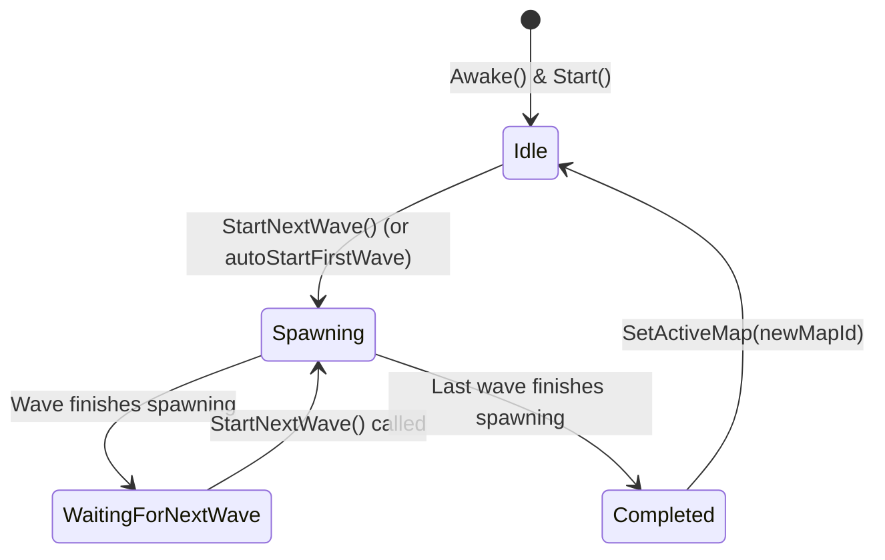
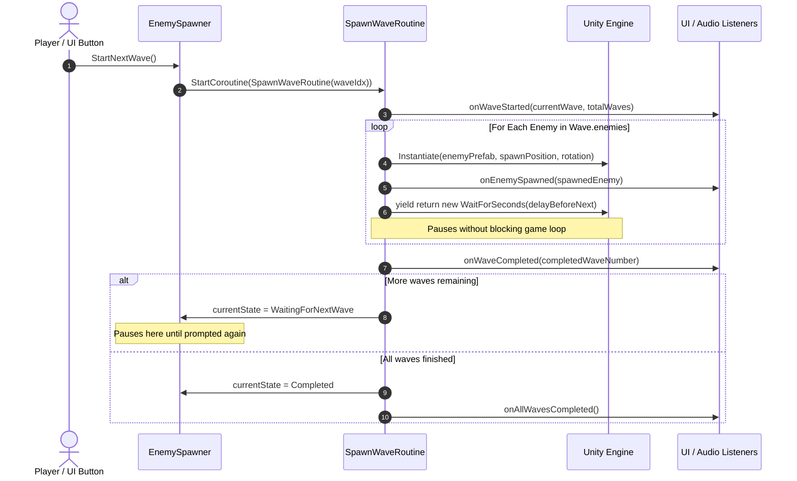

# Technical Documentation: EnemySpawner.cs

**Target Unity Version**: Unity 6 (`6000.6.0f1`)  
**Context**: 2D Tower Defense Game  
**File Location**: `Assets/Scripts/EnemySpawner/EnemySpawner.cs`  
**Companion File**: `Assets/Scripts/EnemySpawner/MapWaveDataSO.cs`

---

## 1. Overview & Architecture

`EnemySpawner` is a modular, event-driven enemy spawning controller designed specifically for 2D Tower Defense games. It decouples game logic from UI and audio using the Observer pattern (`UnityEvent`), supports multiple map configurations, and paces enemy spawns through Unity Coroutines.

### Key Architectural Pillars
- **Map-Specific Wave Data**: Dynamically swaps enemy compositions and wave profiles depending on the active map.
- **Sequential Coroutine Spawning**: Spawns enemies one at a time with configurable per-enemy delays without blocking the main thread or dropping framerates.
- **Wave Delineation & Pausing**: Automatically pauses upon completing all spawns in a wave and waits indefinitely in `WaitingForNextWave` state until explicitly prompted.
- **Loose Coupling via UnityEvents**: Fires events for UI updates (wave counters, victory banners), sound effects, and enemy targeting without hardcoding references.
- **Living Enemy Tracking**: Tracks instantiated enemies and provides optional gating to ensure all enemies are defeated before the next wave can start.

---

## 2. State Machine: `SpawnerState`

```csharp
public enum SpawnerState
{
    Idle,               // Initialized; waiting for the first wave to be triggered
    Spawning,           // Currently iterating through the active wave's enemy list
    WaitingForNextWave, // Finished spawning current wave; paused until prompted
    Completed           // All waves for the active map are finished
}
```



---

## 3. Inspector Fields Reference

### Spawn Position
| Field | Type | Default | Description |
| :--- | :--- | :--- | :--- |
| `defaultSpawnPoint` | `Transform` | `null` | Primary 2D location where enemies appear. If unassigned, defaults to the Spawner's own `transform` in `Awake()`. |
| `enemyContainer` | `Transform` | `null` | Optional parent Transform in the Hierarchy (e.g. an empty GameObject named `"Enemies"`) to keep the Hierarchy organized. |

### Map Configuration
| Field | Type | Default | Description |
| :--- | :--- | :--- | :--- |
| `activeMapId` | `string` | `"Map_01"` | Identifier of the active map. Used to match against configured wave profiles. |
| `autoDetectMapFromScene` | `bool` | `false` | If `true`, sets `activeMapId` to `SceneManager.GetActiveScene().name` upon `Start()`. |
| `activeMapConfigOverride` | `MapWaveDataSO` | `null` | Direct asset slot. If assigned, overrides all other configuration lists. |
| `scriptableMapConfigs` | `List<MapWaveDataSO>` | Empty | List of project assets created via `Assets > Create > Tower Defense > Map Wave Config`. |
| `inlineMapConfigs` | `List<MapWaveData>` | Empty | Wave configurations defined directly inside the component's inspector. |

### Wave Progression Settings
| Field | Type | Default | Description |
| :--- | :--- | :--- | :--- |
| `autoStartFirstWave` | `bool` | `false` | If `true`, begins Wave 1 immediately when the scene starts. If `false`, waits for `StartNextWave()`. |
| `requireEnemiesClearedBeforeNextWave` | `bool` | `false` | If `true`, prevents `StartNextWave()` from running until all living enemies have been defeated. |

### Unity Events
| Event | Signature | When Triggered | Common Use Cases |
| :--- | :--- | :--- | :--- |
| `onEnemySpawned` | `UnityEvent<GameObject>` | Right after an enemy is instantiated. | Minimap tracking, registering enemy with defense towers, spawn SFX. |
| `onWaveStarted` | `UnityEvent<int, int>` | At the start of a wave `(currentWaveNum, totalWaves)`. | Updating HUD text (e.g., *"Wave 2 / 10"*), playing wave start horn. |
| `onWaveCompleted` | `UnityEvent<int>` | When the last enemy of a wave finishes spawning `(completedWaveNum)`. | Re-enabling the "Next Wave" button, wave clear bonus audio. |
| `onAllWavesCompleted` | `UnityEvent` | When the final wave on the map finishes. | Triggering the Victory screen, unlocking the next map. |
| `onMapChanged` | `UnityEvent<string>` | When switching active maps via `SetActiveMap`. | Updating map title HUD, changing background music. |

---

## 4. Public API & Properties

### Properties (Read-Only)
- **`SpawnerState CurrentState`**: The current state of the spawner (`Idle`, `Spawning`, `WaitingForNextWave`, `Completed`).
- **`string ActiveMapId`**: The ID of the currently loaded map.
- **`int CurrentWaveIndex`**: Zero-based index of the current wave (`0` for Wave 1).
- **`int CurrentWaveNumber`**: 1-based wave number (`currentWaveIndex + 1`) for UI display.
- **`int TotalWaves`**: Total number of waves configured for the active map.
- **`int LivingEnemyCount`**: Current count of living spawned enemies.
- **`bool IsSpawning`**: Returns `true` if a wave is currently actively spawning.

### Public Methods

#### `void StartNextWave()`
```csharp
[ContextMenu("Start Next Wave")]
public void StartNextWave()
```
- **Description**: Prompts the spawner to begin spawning the next wave in sequence.
- **Safety Checks**:
  - Rejects execution if already `Spawning`.
  - Rejects execution if already `Completed`.
  - Rejects execution if `requireEnemiesClearedBeforeNextWave` is enabled and enemies remain alive.
  - Terminates any lingering coroutines before starting `SpawnWaveRoutine`.
- **Inspector Context Menu**: Can be tested directly during Play Mode by right-clicking the component header in the Inspector.

#### `void SetActiveMap(string mapId)`
```csharp
public void SetActiveMap(string mapId)
```
- **Description**: Stops any ongoing spawns, resets wave progress to 0, clears tracked enemies, and loads the wave configuration matching `mapId`. Fires `onMapChanged`.

#### `void NotifyEnemyDefeated(GameObject enemy)`
```csharp
public void NotifyEnemyDefeated(GameObject enemy)
```
- **Description**: Call this from an enemy's health or death script to decrement `LivingEnemyCount`. (Also cleans up destroyed references automatically).

#### `void StopSpawning()`
```csharp
public void StopSpawning()
```
- **Description**: Immediately terminates the active spawn coroutine and resets state to `Idle`.

---

## 5. Execution Flow

### Wave Spawning Lifecycle (`SpawnWaveRoutine`)



---

## 6. Setup & Integration Guide

### Step 1: Component Attachment
1. In your Unity Scene, create an empty GameObject named `EnemySpawner`.
2. Add the `EnemySpawner` component.
3. Create an empty child GameObject named `SpawnPoint`, place it at the start of your 2D path, and drag it into **Default Spawn Point**.
4. *(Optional)* Create an empty GameObject named `EnemiesContainer` and drag it into **Enemy Container**.

### Step 2: Creating Wave Data via ScriptableObjects (Recommended)
1. In the Project window, navigate to your desired folder (e.g. `Assets/Data/Maps/`).
2. Right-click and choose **Create > Tower Defense > Map Wave Config**.
3. Name the asset `Map1_Waves`.
4. In the Inspector for this asset:
   - Set `Map Id` to `Map_01`.
   - Click `+` under **Waves** to add Wave 1, Wave 2, etc.
   - For each wave, click `+` under **Enemies** and assign your enemy 2D prefabs and `delayBeforeNext` intervals.
5. Drag `Map1_Waves` into **Active Map Config Override** (or into **Scriptable Map Configs**) on the `EnemySpawner`.

### Step 3: Wiring UI Buttons
1. Create a UI Button in your Canvas (e.g. *"Start Next Wave"*).
2. In the Button's **On Click ()** list in the Inspector:
   - Click `+`.
   - Drag the `EnemySpawner` GameObject into the object slot.
   - Select function: **`EnemySpawner -> StartNextWave()`**.
3. To disable the button while spawning and re-enable it when paused:
   - In `onWaveStarted`: add the Button and set `Button.interactable = false`.
   - In `onWaveCompleted`: add the Button and set `Button.interactable = true`.
