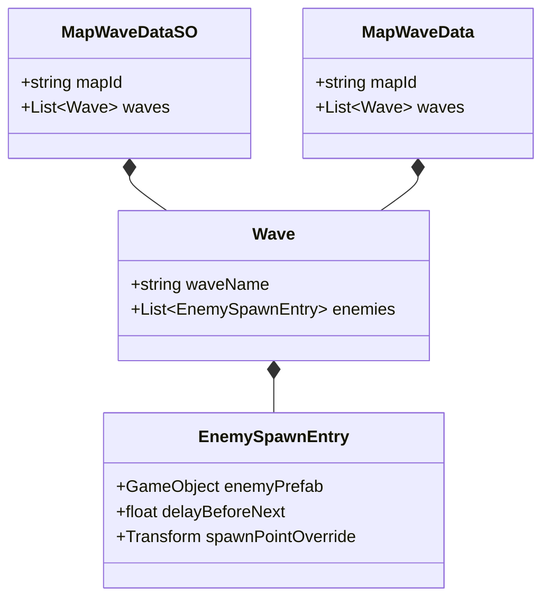

# Technical Documentation: MapWaveDataSO.cs

**Target Unity Version**: Unity 6 (`6000.6.0f1`)  
**Context**: 2D Tower Defense Game  
**File Location**: `Assets/Scripts/EnemySpawner/MapWaveDataSO.cs`  
**Consumer File**: `Assets/Scripts/EnemySpawner/EnemySpawner.cs`

---

## 1. Overview & Purpose

`MapWaveDataSO.cs` defines the **data architecture and schema** for the tower defense wave spawning system. It contains no gameplay execution or update logic; instead, it establishes clean, serialized data structures that separate **game data** from **game code**.

### Why use ScriptableObjects for Waves?
- **Scene Independence**: Wave configurations are saved as `.asset` files in your Project window, not tied to any scene GameObject.
- **Easy Balancing & Tuning**: Designers can adjust enemy numbers, delays, and compositions without writing code or risking merge conflicts in scene files.
- **Variant Configurations**: Create multiple variations of the same map (e.g., `Forest_Easy.asset`, `Forest_Hard.asset`, `Endless_Mode.asset`) and hot-swap them instantly.

---

## 2. Data Structures Reference



### 1. `EnemySpawnEntry`
Represents an individual enemy spawn event in a wave sequence.

```csharp
[Serializable]
public class EnemySpawnEntry
{
    public GameObject enemyPrefab;
    public float delayBeforeNext = 1f;
    public Transform spawnPointOverride;
}
```

| Field | Type | Attributes | Description |
| :--- | :--- | :--- | :--- |
| `enemyPrefab` | `GameObject` | `[Tooltip]` | The 2D enemy prefab to instantiate. |
| `delayBeforeNext` | `float` | `[Tooltip]`, `[Min(0f)]` | Number of seconds to wait **after** this enemy spawns before the next enemy appears. Clamped to $\ge 0$. |
| `spawnPointOverride` | `Transform` | `[Tooltip]` | Optional spawn point override. If `null`, the spawner's default spawn point is used. |

---

### 2. `Wave`
Represents a single wave containing a sequence of enemies.

```csharp
[Serializable]
public class Wave
{
    public string waveName = "Wave 1";
    public List<EnemySpawnEntry> enemies = new List<EnemySpawnEntry>();
}
```

| Field | Type | Default | Description |
| :--- | :--- | :--- | :--- |
| `waveName` | `string` | `"Wave 1"` | Display name for HUDs, logs, and Inspector identification. |
| `enemies` | `List<EnemySpawnEntry>` | `new List()` | The ordered list of enemies to spawn sequentially in this wave. |

---

### 3. `MapWaveData`
A lightweight, serializable container for maps used for **inline Inspector configuration**.

```csharp
[Serializable]
public class MapWaveData
{
    public string mapId = "Map_01";
    public List<Wave> waves = new List<Wave>();
}
```

| Field | Type | Default | Description |
| :--- | :--- | :--- | :--- |
| `mapId` | `string` | `"Map_01"` | Unique identifier or scene name matching the active map. |
| `waves` | `List<Wave>` | `new List()` | List of delineated waves for this map. |

---

### 4. `MapWaveDataSO`
The `ScriptableObject` asset container for storing map configurations as permanent project files.

```csharp
[CreateAssetMenu(fileName = "NewMapWaveConfig", menuName = "Tower Defense/Map Wave Config", order = 1)]
public class MapWaveDataSO : ScriptableObject
{
    public string mapId = "Map_01";
    public List<Wave> waves = new List<Wave>();
}
```

- **`[CreateAssetMenu]`**: Exposes an asset creation shortcut in the Unity Project window under **Assets > Create > Tower Defense > Map Wave Config**.
- **Inheritance**: Inherits from `UnityEngine.ScriptableObject`, allowing it to be serialized as an `.asset` file on disk.

---

## 3. Why `[Serializable]` is Crucial

In C#, custom classes (`Wave`, `EnemySpawnEntry`, `MapWaveData`) are plain objects in memory. Unity’s serialization system **ignores** custom classes unless decorated with `[System.Serializable]`.

Adding `[Serializable]`:
1. Instructs Unity to save the class's data into scenes, prefabs, and `.asset` files.
2. Generates the nested Inspector GUI (lists, foldout arrows, drag-and-drop slots).

---

## 4. Workflow & Step-by-Step Guide

### Step 1: Create a Map Wave Asset
1. In the Unity Project window, navigate to your data folder (e.g. `Assets/Data/Maps/`).
2. **Right-click** in empty space &rarr; **Create > Tower Defense > Map Wave Config**.
3. Name the asset file (e.g., `Forest_Map_Waves`).

### Step 2: Configure Map ID & Waves
1. Select the new `Forest_Map_Waves` asset in the Project window.
2. In the **Inspector**:
   - Set **Map Id** to match your map identifier (e.g., `"Forest"` or your Scene name).
   - Under **Waves**, click **`+`** to add a wave.
   - Set **Wave Name** (e.g., `"Wave 1 - Scouts"`).

### Step 3: Populate Enemy Sequence
1. Under your new wave, expand the **Enemies** list and click **`+`** to add enemies.
2. Drag your 2D enemy prefab into **Enemy Prefab**.
3. Set **Delay Before Next**:
   - **Fast Swarm**: Set delay to `0.3` – `0.5` seconds.
   - **Standard March**: Set delay to `1.0` – `1.5` seconds.
   - **Boss Warning**: Set delay to `3.0` – `5.0` seconds to give the player breathing room.
4. *(Optional)* If an enemy should enter from an alternate route (e.g. flying enemies), drag a Transform into **Spawn Point Override**.

### Step 4: Hooking into `EnemySpawner`
* **Direct Single-Map Approach**: Drag `Forest_Map_Waves` into the `Active Map Config Override` slot on your scene's `EnemySpawner`.
* **Multi-Map Asset Library**: Add `Forest_Map_Waves`, `Desert_Map_Waves`, etc., to the `Scriptable Map Configs` list on `EnemySpawner`.
