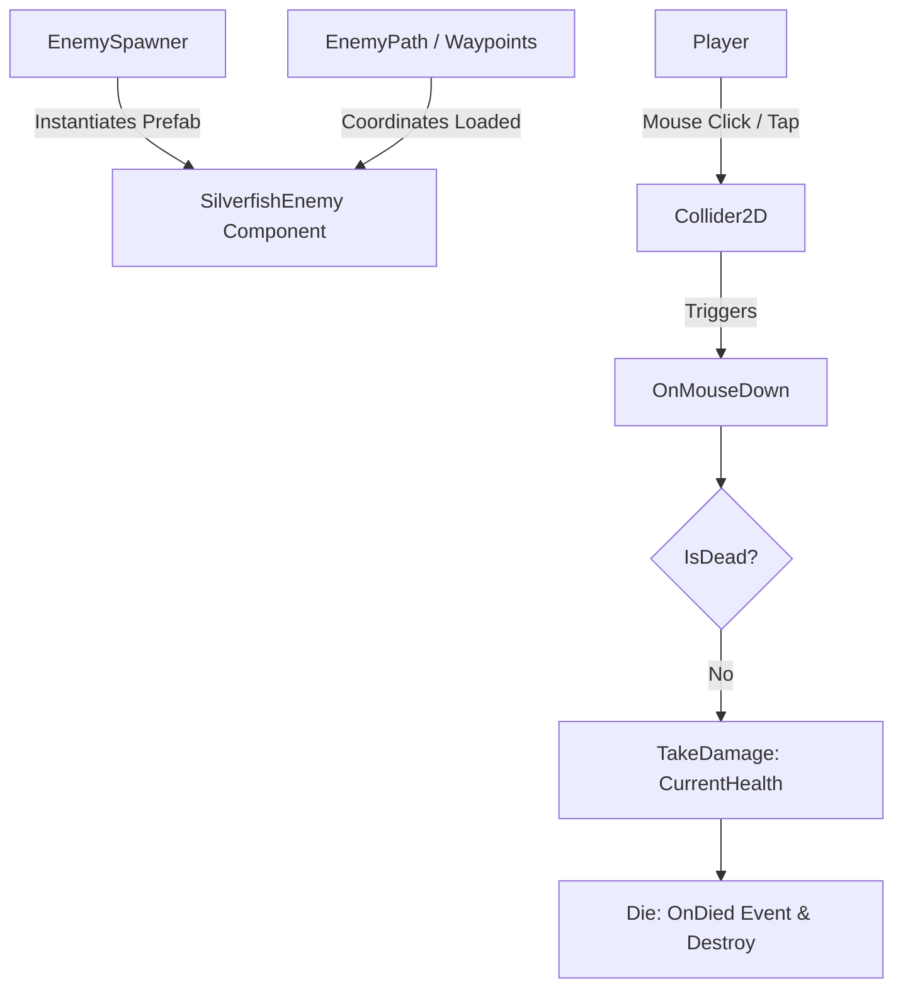

# Technical Documentation: SilverfishEnemy.cs

**Target Unity Version**: Unity 6 (`6000.6.0f1`)  
**Context**: 2D Hybrid Tower Defense Game  
**File Location**: `Hold the Hill/unity/Assets/_Game/Features/Enemies/Scripts/EnemySubclasses/SilverfishEnemy.cs`  
**Companion Files**: 
- `Hold the Hill/unity/Assets/_Game/Features/Enemies/Scripts/Basic Enemy/BasicEnemy.cs`

---

## 1. Overview & Architecture

`SilverfishEnemy` is a specialized subclass of `BasicEnemy`. The key differentiator for this enemy type is its vulnerability to direct player interaction: it can be instantly defeated when clicked by the player.

This component relies on Unity's built-in 2D physics events (`OnMouseDown`) to detect player clicks. When clicked, it bypasses traditional combat damage calculations by instantly depleting its remaining health pool, reusing the robust death handling and event dispatching (`OnDied`, `OnHealthChanged`) provided by its parent class.

### Key Architectural Pillars
- **Inheritance over Composition**: By inheriting from `BasicEnemy`, it automatically integrates with existing pathfinding, health tracking, movement behavior, and spawner events without any duplicate logic.
- **Instant Defeat Mechanic**: Overrides standard health reduction by applying damage equal to `CurrentHealth`, ensuring that all standard events (`OnHealthChanged`, `OnDied`) are correctly fired for UI and combat systems to observe.
- **Physics Dependency**: Uses the `[RequireComponent(typeof(Collider2D))]` attribute. Unity's `OnMouseDown` requires a physics collider (such as `BoxCollider2D` or `CircleCollider2D`) on the GameObject to intercept raycasts from the main camera.

---

## 2. Inspector Fields Reference

This script inherits all fields from `BasicEnemy` (such as `_maxHealth`, `_damage`, `_moveSpeed`, etc.). It does not add any new serialized fields of its own.

### Inherited Fields (from `BasicEnemy`)
- **Health & Combat**: `_maxHealth`, `_damage`
- **Path & Movement**: `_moveSpeed`, `_waypointTolerance`, `_pathCoordinates`
- **Visuals**: `_flipSpriteFacing`

---

## 3. Public API & Lifecycle

### Methods

#### `private void OnMouseDown()`
- **Description**: A Unity lifecycle method invoked automatically when the user presses the mouse button while over the `Collider2D` attached to the GameObject. 
- **Behavior**: Checks if the enemy is already dead to prevent redundant processing. If alive, it calls `TakeDamage(CurrentHealth)` on the base class, instantly bringing the health to 0 and triggering the death sequence.

---

## 4. Setup & Usage

To implement a Silverfish enemy in the game:
1. Create a new prefab (or a variant of an existing basic enemy prefab).
2. Attach the `SilverfishEnemy` script instead of `BasicEnemy`.
3. Ensure the GameObject has a `Collider2D` component (e.g., `CircleCollider2D`) attached and properly sized to encompass the sprite. The script will automatically enforce the presence of a generic `Collider2D`.
4. Configure inherited stats (Health, Speed, Damage) in the Inspector.
5. Add the prefab to the `EnemySpawner` wave data.

**Troubleshooting**: If the enemy cannot be clicked in Play mode, verify that no other UI elements are blocking the raycast to the collider.
